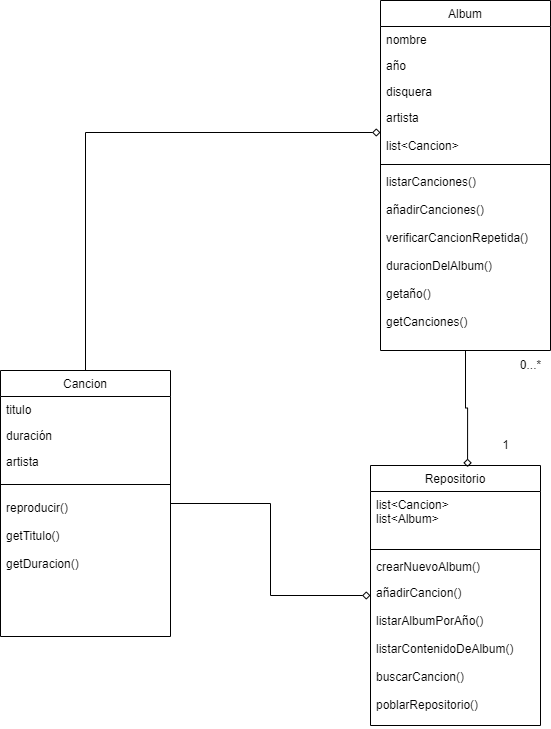

#### 1. Descripción General

**Nombre del Proyecto:** Registro de Álbumes de Música

**Descripción:** Este proyecto tiene como objetivo crear una aplicación que permita a los usuarios registrar y gestionar álbumes de música y sus canciones, asegurando la integridad y facilidad de acceso a la información musical..

#### 2. Lenguaje de Programación

- **Lenguaje:** Java
- **Versión del JDK:** 21

#### 3. Entorno de Desarrollo Integrado (IDE)

- **IDE:** IntelliJ IDEA 2023.3.6 (Ultimate Edition)
#### 4. Control de Versiones

- **Sistema de Control de Versiones:** Git
- **Repositorio Remoto:** GitHub

#### 5. Sistema Operativo

- **Sistema Operativo:** Windows 11

#### 6. Instrucciones de Instalación y Configuración


##### 6.1 Instalación de Java

1. **Descargar e Instalar JDK 21:**
   - Visitar el [sitio web de Oracle](https://www.oracle.com/java/technologies/javase/jdk21-archive-downloads.html).
   - Descargar la versión correspondiente a tu sistema operativo.
   - Seguir las instrucciones de instalación.

2. **Configurar Variables de Entorno:**
   - Añadir `JAVA_HOME` a las variables de entorno apuntando al directorio de instalación del JDK.
   - Añadir `JAVA_HOME\bin` al `PATH`.

##### 6.2 Instalación de IntelliJ IDEA

1. **Descargar IntelliJ IDEA:**
   - Visitar el [sitio web de JetBrains](https://www.jetbrains.com/idea/download/).
   - Descargar la versión Ultimate Edition.

2. **Instalar IntelliJ IDEA:**
   - Seguir las instrucciones de instalación proporcionadas por JetBrains.

3. **Configurar el JDK en IntelliJ IDEA:**
   - Abrir IntelliJ IDEA.
   - Ir a `File > Project Structure > Project`.
   - Configurar el `Project SDK` a JDK 21.

##### 6.3 Configuración del Control de Versiones

1. **Instalar Git:**
   - Visitar el [sitio web de Git](https://git-scm.com/).
   - Descargar e instalar Git para Windows.

2. **Configurar Git en IntelliJ IDEA:**
   - Ir a `File > Settings > Version Control > Git`.
   - Configurar la ruta al ejecutable de Git.

3. **Clonar el Repositorio del Proyecto:**
   - Usar el comando `git clone` con la URL de tu repositorio en GitHub:
     ```bash
     git clone https://github.com/K3v1n17/tarea5_GestionDeAlbumes.git
     ```

#### 7. Ejecución y Pruebas

##### 7.1 Ejecutar la Aplicación

1. **Abrir el Proyecto en IntelliJ IDEA:**
   - Ir a `File > Open` y seleccionar la carpeta del proyecto.

2. **Crear una Configuración de Ejecución:**
   - Ir a `Run > Edit Configurations`.
   - Añadir una nueva configuración de `Application`.
   - Configurar la clase principal (por ejemplo, `Main`).

3. **Ejecutar la Aplicación:**
   - Ir a `Run > Run 'Main'` o presionar `Shift + F10`.
##### 7.2 Diagrama de clases
El diagrama de clases puede ser representado con una herramienta como Draw.io, Lucidchart o cualquier otra herramienta de diagramación UML. A continuación se describe una estructura básica:


##### 7.3 Implementación del Código
A continuación se presenta  la clase *Main* como ejemplo de implementación de código:
```java
public class Main {  
    public static void main(String[] args) {  
        // Historia de usuario 1  
        System.out.println("******Historia 1 - Crear albumes:******");  
        repositorioMusical.crearNuevoAlbum("Album-Salsa", 2018, "DisqueraPro", "Calimeño");  
        repositorioMusical.crearNuevoAlbum("Album-Cumbia", 2010, "Tiny", "Sonora Dinamita");  
          
        // Historia de usuario 2  
        System.out.println("******Historia 2 - agregar canciones a un album existente:******");  
        repositorioMusical.aniadirCancion("Salsa", "Album-Salsa");  
        repositorioMusical.aniadirCancion("Amar", "Album-Salsa");  
        repositorioMusical.aniadirCancion("Amar", "Album-No-Existente");  
  
        // Historia de usuario 3   
System.out.println("******Historia 3 - Evitar agregar canciones repetidas:******");  
        repositorioMusical.aniadirCancion("Salsa", "Album-Salsa");  
  
        // Historia de usuario 4  
        System.out.println("******Historia 4 - Mostrar contenido del album por su nombre junto con su duracion:******");  
        repositorioMusical.listarContenidoDeAlbum("Album-Salsa");  
  
        // Historia de usuario 5  
        System.out.println("******Historia 5 - Busqueda de album por año:******");  
        repositorioMusical.listarAlbumesPorAnio("2024");  
        repositorioMusical.listarAlbumesPorAnio("2018");  
    }  
}
```

#### 8. Convenciones de Codificación

##### 8.1 Nombres de Clases

- Usar **CamelCase** para nombres de clases. 
- Ejemplo: `Album`, `Song`.

##### 8.2 Nombres de Métodos y Variables

- Usar **camelCase** para nombres de métodos y variables.
- Ejemplo: `addSong`, `getDuration`.

##### 8.3 Nombres de Constantes

- Usar **UPPER_CASE** para nombres de constantes.
- Ejemplo: `MAX_SONG_DURATION`.

##### 8.4 Formato del Código

- **Indentación:** Usar 4 espacios por nivel de indentación.
- **Llaves:** Las llaves deben estar en la misma línea que la declaración.

##### 8.5 Comentarios

- Usar comentarios para explicar el propósito de las clases, métodos y cualquier lógica compleja.
- Ejemplo:

    ```java
    public void crearNuevoAlbum(String nombreAlbum, int anio, String disquera, String artista) {
    // Crear una nueva instancia de Album con los datos proporcionados
    Album album = new Album(nombreAlbum, anio, disquera, artista);
    
    // Agregar el nuevo álbum a la lista de álbumes
    listaAlbumes.add(album);
    
    // Imprimir un mensaje de confirmación en la consola
    System.out.println("Album: " + album.getNombre() + ". Creado exitosamente");
}
    
```
### 9. Conclusión

Esta documentación detalla cómo configurar el ambiente de desarrollo, incluye un diagrama de clases básico y proporciona una implementación de ejemplo del código fuente. Siguiendo estas instrucciones, los desarrolladores podrán reproducir y continuar el desarrollo del proyecto conforme a los requisitos establecidos en las historias de usuario.